# 简介

## 在 GitHub 上创建仓库

首先，打开 [GitHub](https://github.com/) 注册个人账户并登录。点击 `New repository` 创建新的仓库：

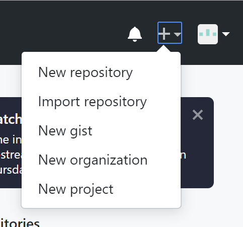

打开页面如下图所示，填入相关信息。注意下图紫色框中有两个下拉按钮，左边的用来选择忽略文件，右边的用来选择所属协议，这两项可以不选，后面的课程会讲到。

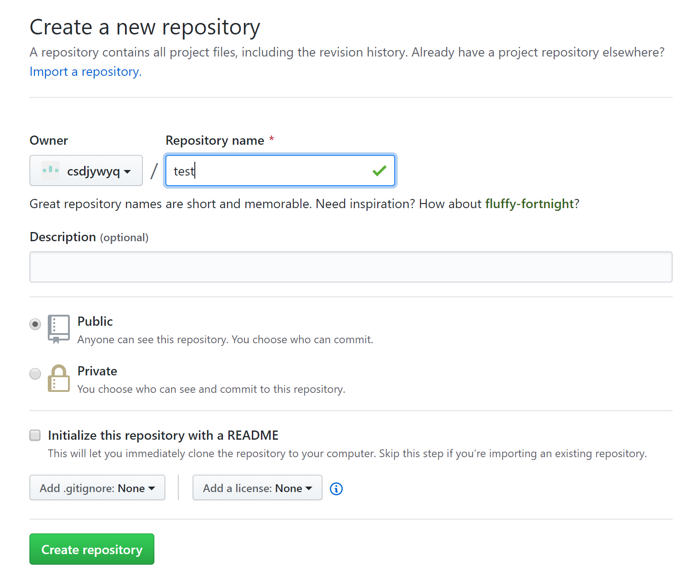点击绿色按钮创建新的仓库，成功后自动跳转到新建仓库的主页面，如下图所示：

## 克隆仓库到本地：

以下的操作在fork的岗前培训仓库完成。

### 复制链接

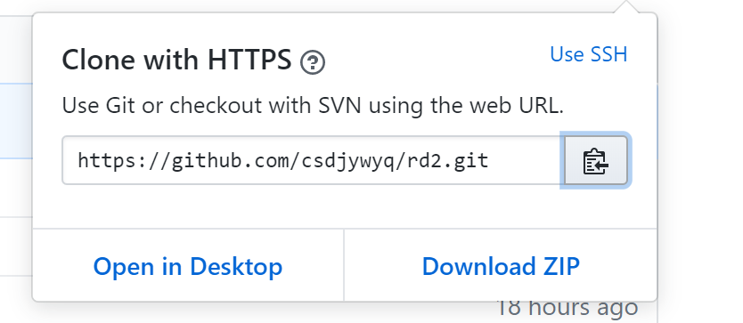

### 克隆

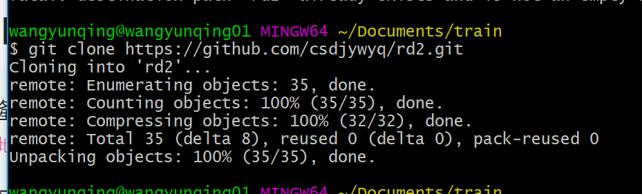

### 查看克隆结果

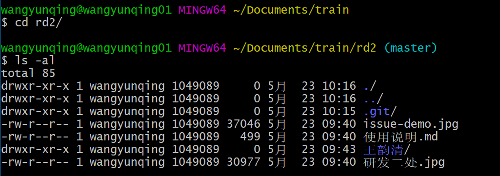

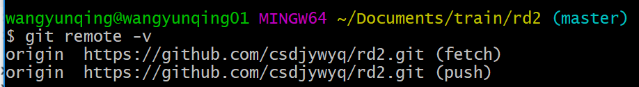

## 初始化一个本地仓库

### 初始化后并取消本地仓库

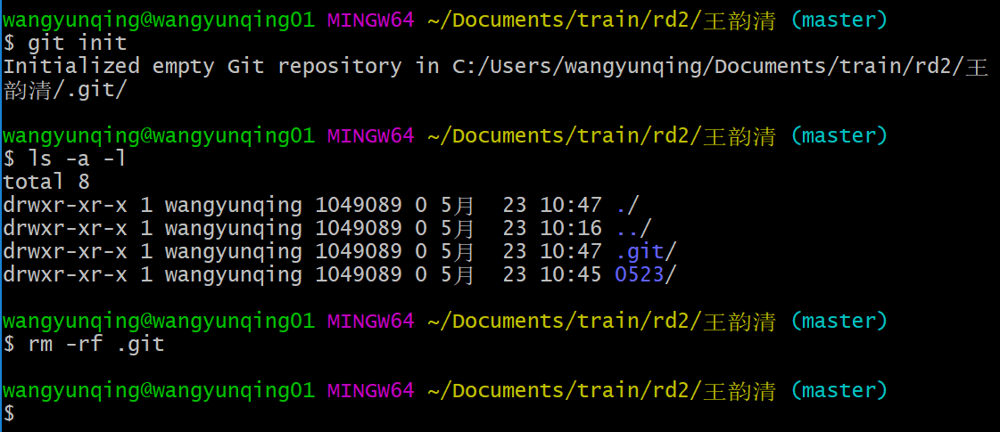

# Git 基础操作

## Git仓库的三大区域

Git 本地仓库有三大区域：工作区、暂存区、版本区。

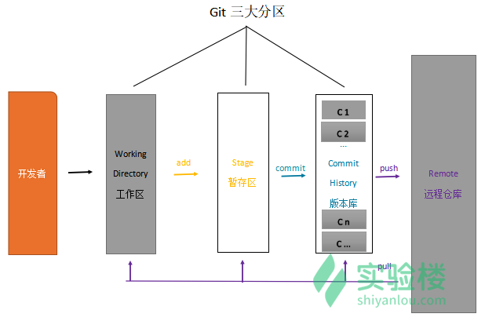

## 一次完整的修改、提交、推送操作

进入仓库主目录，执行 `git status` 查看整个仓库的状态：（此处因为已经修改过）

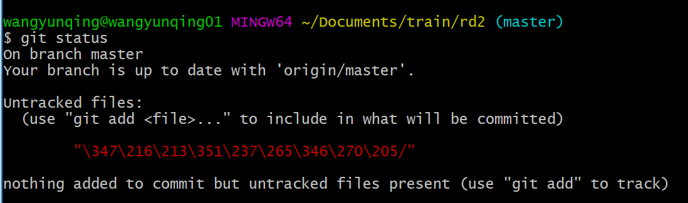

## 对工作区进行修改

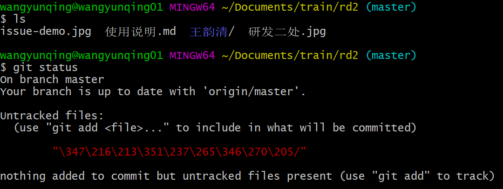

## 添加到暂存区以及撤销修改

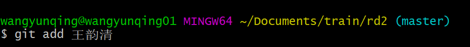

如果对多个文件或目录进行了增删改，可以使用 `git add .`命令全部添加到暂存区。

注意这里有个概念，当我们修改了工作区，`git add` 命令是将这些修改添加到暂存区，暂存区记录的只是修改。如果要撤销暂存区的修改怎么办？根据上图的提示，执行 `git reset -- [文件名]` 或者 `git rm --cached [文件名]` 命令即可：

上图的命令，如果省略最后的文件名，把命令写成 `git reset --` 即可把暂存区的全部修改撤销。

 `git diff`，它可以用来查看工作区被跟踪的文件的修改详情

使用 `git diff --cached` 查看暂存区的全部修改：

## 查看提交历史

执行 `git commit` 命令把暂存区的修改提交到版本区，生成一个新的版本。

命令 `git log`，它用来查看版本区的提交历史记录。此命令也会跳到新页面，如下图所示：

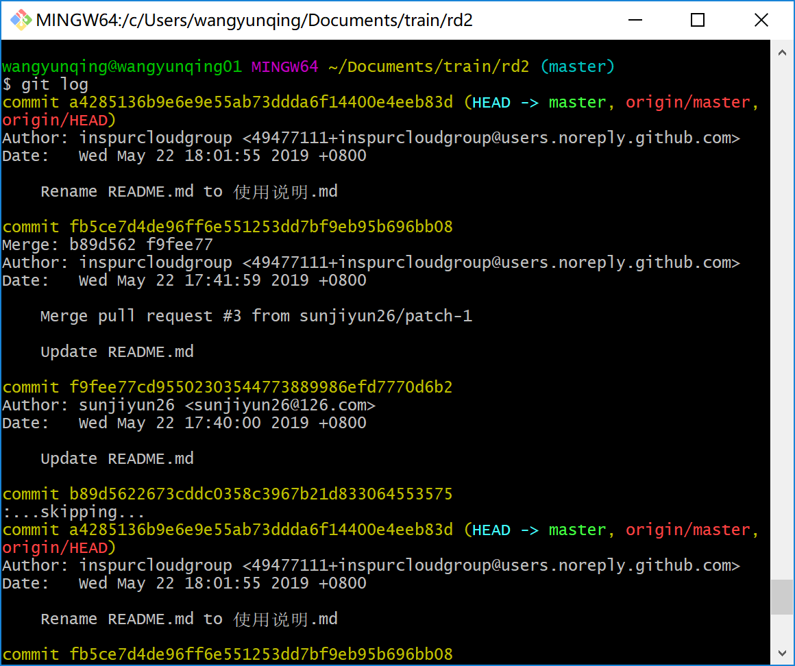

关于查看提交历史记录的命令，有些常用的选项介绍一下：

- `git log [分支名]` 查看某分支的提交历史，不写分支名查看当前所在分支
- `git log --oneline` 一行显示提交历史
- `git log -n` 其中 n 是数字，查看最近 n 个提交
- `git log --author [贡献者名字]` 查看指定贡献者的提交记录
- `git log --graph` 图示法显示提交历史

## 配置个人信息

（此处用处不大，就没进行本地配置）

接下来需要对 Git 进行一些本地配置：

- `user.email`：写入你自己注册 GitHub 账号的邮箱
- `user.name`：你自己的 GitHub 账号名字

这两个命令设置你的身份信息如下图。`git config -l` 可以查看配置信息（就不展示截图了）：

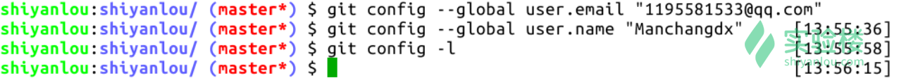

完成后，系统自动生成 Git 的配置文件，就是家目录中的隐藏文件 `.gitconfig` ：

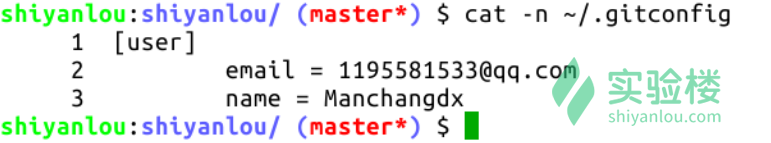

上图所示的配置文件也是可以直接手动修改。

## 提交暂存区的修改

### 提交

现在执行 `git commit` 命令生成一个新的提交，一个必须的选项 `-m` 用来提供该提交的备注：

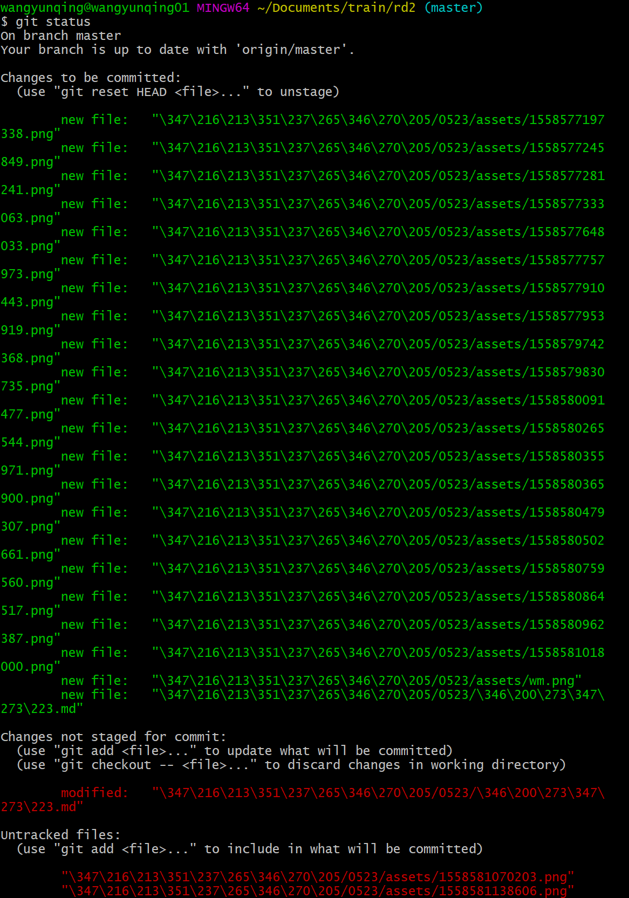

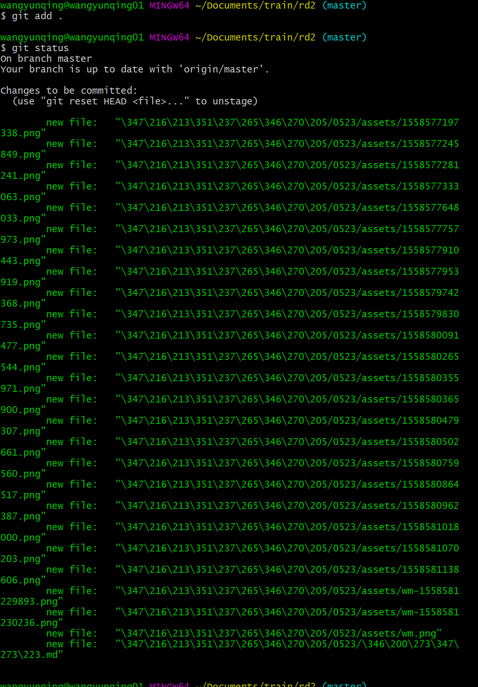

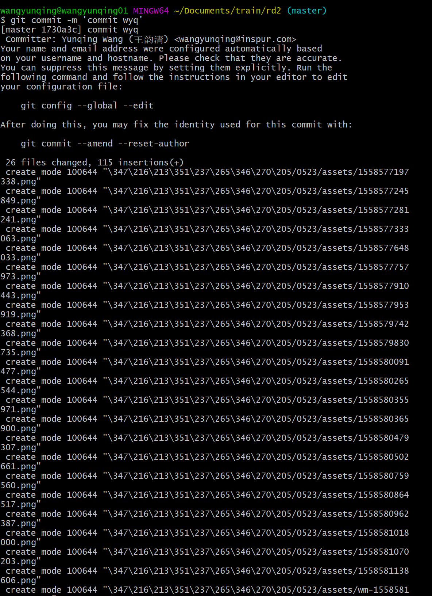

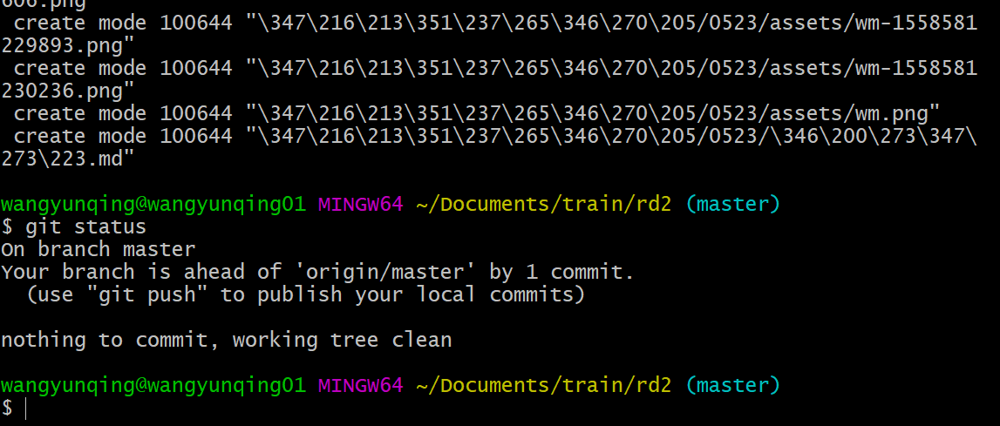

提交后，暂存区的修改被清空，执行 `git log` 查看提交记录，红色框中的十六进制序列号就是提交版本号，这是很重要的信息，每个提交都有自己单独的版本号，就像公民身份证号一样：

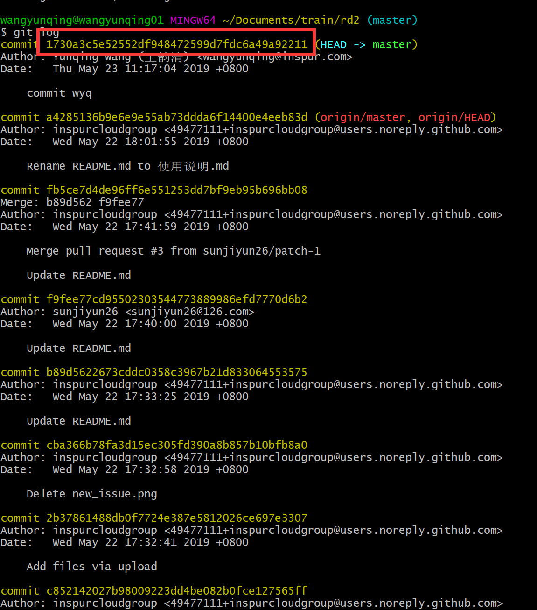

默认为时间倒叙排列，若是需要正序排列信息，则需要 `git log --reverse` 命令。

### 查看所有分支信息

命令 `git branch -avv`，它用来查看全部分支信息：

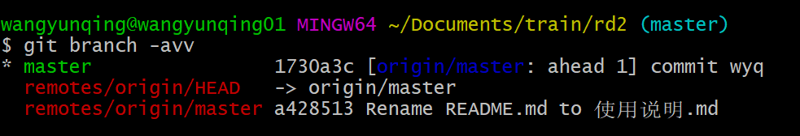

上图有三行信息，依次说明:

- 第一行，开头的星号表示当前所在分支，绿色的 master 是分支名，之所以是绿色，也是因为它是当前所在分支。后面第二项是版本号，第三项中括号里面蓝色的字，表示此分支跟踪的远程分支的名字，当然啦，这也是克隆远程仓库到本地时的默认设置 -- 创建 master 分支并自动跟踪远程同名分支；冒号后面黑色文字表示本地分支领先其跟踪的远程分支一个提交。最后一项是提交时填写的备注信息。

- 第二行，是 Git 指针信息，它指向远程仓库的 master 分支，这行信息暂不重要。

- 第三行，远程分支信息，详见第一行的解释。

  （相对不推荐）在执行 `commit` 命令时，再介绍一个我并不推荐的选项 `-a` ，它的作用是将未添加到暂存区的修改，也就是工作区的修改也一并提交，但会略过未被跟踪的文件，比如新建文件 one.txt，此命令的完整格式：`git commit -am xxxxx` 。

  谨慎的做法是按照前文的顺序，修改工作区 - 提交到暂存区 - 随时使用 `git status` 查看仓库状态 - 将暂存区的修改提交到版本区生成一次新的提交。

### 推送到远程仓库

最后一个环节，将本地新增的提交推送到 GitHub 远程仓库中，命令是 `git push`，后面不需要任何选项和参数，此命令会把本地仓库 master 分支上的新增提交推送到远程仓库的同名分支上，因为当前所在的分支就是 master，而且上文提到，它已经跟踪了远程仓库的同名分支：

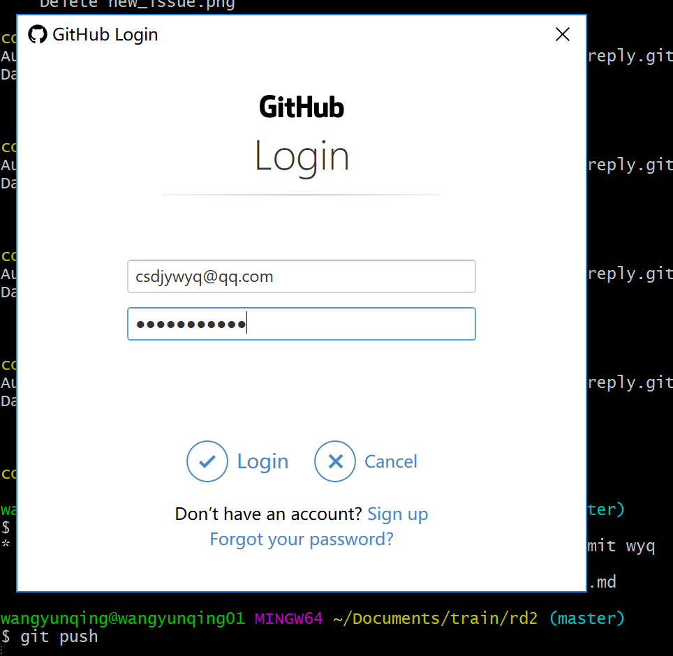

推送成功后执行 `git branch -avv` 查看分支情况：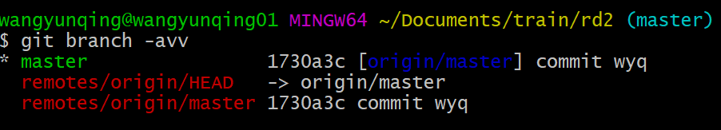

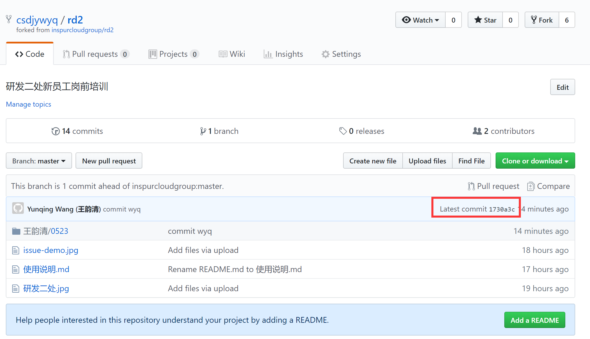

本地和远端一致。

以上就是一次完整的修改 - 提交 - 推送操作。一次推送中可以包含多个 `git commit` 操作，也就是多个提交可以一起推送。

## 版本回退

如果发现文件内容有误，怎么做？可以修改此文件然后再次添加到暂存区、提交、推送，也可以撤销最近一次提交，修改文件后重新提交推送。现在使用后一种方法来演示撤销提交的操作流程。

首先执行 `git reset --soft HEAD^` 撤销最近的一次提交，将修改还原到暂存区。`--soft` 表示软退回，对应的还有 `--hard`硬退回，后面会讲到，`HEAD^` 表示撤销一次提交，`HEAD^^` 表示撤销两次提交，撤销 n 次可以简写为 `HEAD~n`。软退回一个提交后执行 `git branch -avv` 命令查看分支信息：

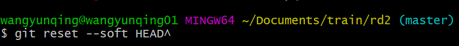

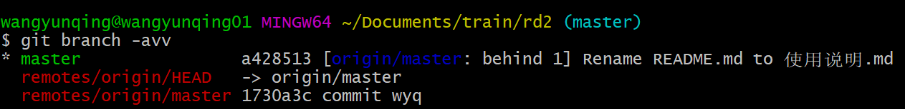

版本号已经变化。

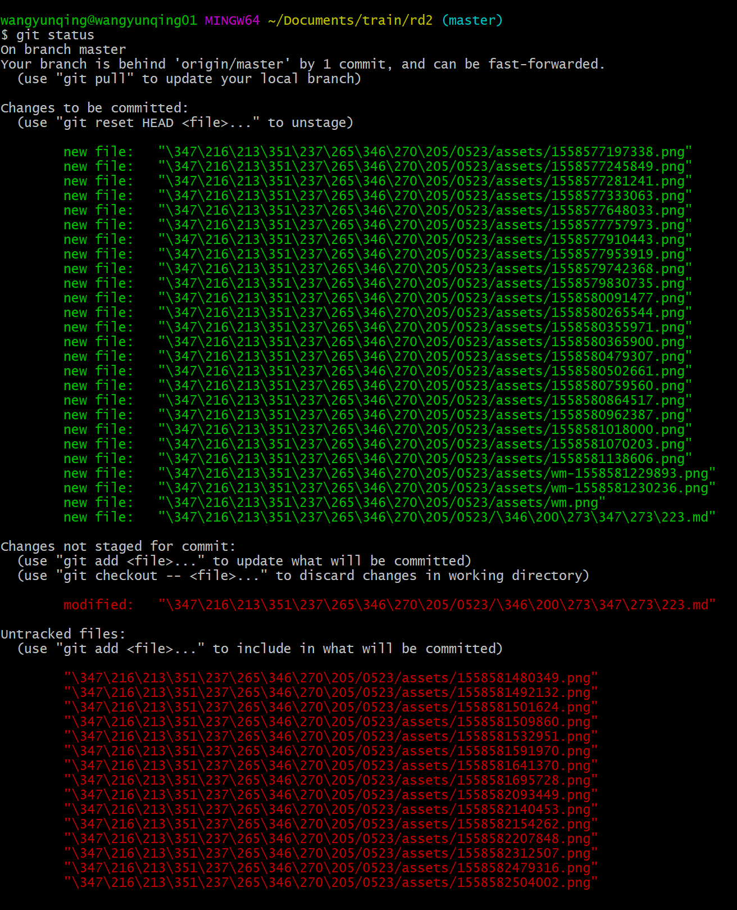

## 处理commit时间线分叉

本地仓库的 master 分支与远程仓库的 origin/master 分支在提交版本上有了冲突，又叫做提交时间线分叉。因为刚才的提交操作不是基于远程仓库 origin/master 分支的最新提交版本，而是撤回了一个版本。这种情况下也是可以将本地 master 分支推送到远程仓库的，需要加一个选项 `-f` ，它是 `--force` 的简写，这就是强制推送：

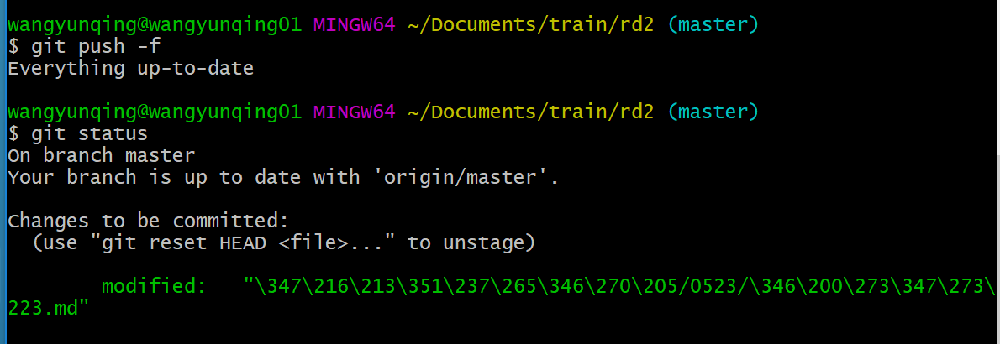

## 本地仓库 commit 变化记录

假设此时发现情况不对，之前的那次版本号为 5c04 的提交是正确的，刚才的版本回退操作全都是误操作，怎么办？再次执行一次版本回退吗？当然不需要啦，我们有 `git reflog`命令，它会记录本地仓库所有分支的每一次版本变化。实际上只要本地仓库不被删除，随你怎么折腾，都能回退到任何地方。`reflog` 记录只存在于本地仓库中，本地仓库删除后，记录消失。执行此命令如下图所示：
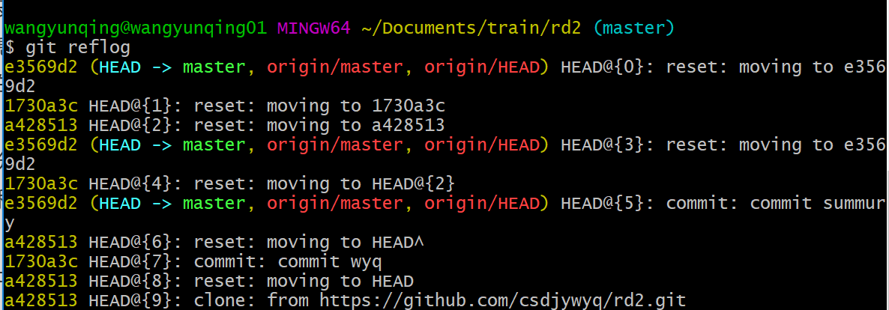

怎么回退到指定版本呢？可以直接执行命令 `git reset --hard [版本号]` ，如果记不清版本号，也可以执行 `git reset --hard HEAD@{2}` 命令，其中 `HEAD@{2}` 就是上图第 3 行第 2 列所示，这个命令的意思是回到当前分支最近两次提交版本变化前（此命令在commit之前不要执行，之前就因为此丢失了部分笔记）。

重要的一点，本节全部命令中，只有 `push` 是需要联网执行的，它对远程仓库进行了修改。